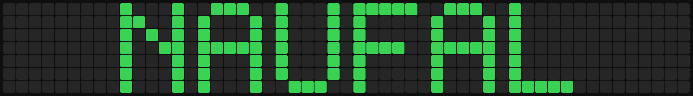

# calender-svgpainter

Paint a GitHub-style `53x7` contribution grid, generate a transparent SVG banner from it, and keep the generated assets up to date with GitHub Actions.

## What this repo contains

- `painter/helper.html`: browser-based painter UI
- `painter/canvas.json`: source of truth for your painted design
- `scripts/render_github_painter_canvas.ps1`: renderer that generates SVG assets
- `.github/workflows/painter-banner.yml`: workflow that regenerates assets on push
- `Assets/github-painter-preview.svg`: full grey-board preview
- `Assets/github-painter-banner.svg`: cropped transparent export for README banners

## Preview



## Paint your own name

The board is always a fixed `53x7` grid:

- `53` columns = GitHub-style week columns
- `7` rows = day rows
- `.` = empty cell
- `1`, `2`, `3`, `4` = green intensity levels

Open [painter/helper.html](./painter/helper.html) in your browser and paint directly on the grid.

Controls:

- Drag with mouse to paint
- Right click to erase a cell
- `space` = erase brush
- `a` = level `1`
- `s` = level `2`
- `d` = level `3`
- `f` = level `4`
- `esc` = clear the board

Helpful workflow for painting a name by eye:

1. Start with brush `4` for the main letter shapes.
2. Use one empty column between letters so the text stays readable.
3. Keep each letter inside a `5x7` or `4x7` block.
4. Use `2` or `3` if you want slight shading, but keep the outline simple first.
5. Use the grey preview board for spacing, not the transparent export.

If you want to save your work from the helper:

1. Click `Download canvas.json ->`
2. Replace `painter/canvas.json` with that file
3. Commit and push

You can also:

- click `Copy canvas JSON` and paste it into `painter/canvas.json`
- click `Import canvas.json` to continue editing an existing design

## canvas.json format

`painter/canvas.json` must stay in this shape:

```json
{
  "version": 1,
  "repositoryUrl": "https://github.com/YOUR_USER/YOUR_REPO.git",
  "year": 2026,
  "columns": 53,
  "rows": 7,
  "grid": [
    ".....................................................",
    ".....................................................",
    ".....................................................",
    ".....................................................",
    ".....................................................",
    ".....................................................",
    "....................................................."
  ]
}
```

Notes:

- The renderer enforces exactly `53` columns and `7` rows.
- Any character other than `.1234` is normalized to `.`.
- The `repositoryUrl` and `year` fields are metadata for the helper UI.

## GitHub Actions usage

This repo includes [painter-banner.yml](./.github/workflows/painter-banner.yml).

It runs automatically when either of these files changes on `main`:

- `painter/canvas.json`
- `scripts/render_github_painter_canvas.ps1`

It can also be run manually from the GitHub Actions tab with `workflow_dispatch`.

What the workflow does:

1. Checks out the repo
2. Runs `./scripts/render_github_painter_canvas.ps1`
3. Regenerates:
   - `Assets/github-painter-preview.svg`
   - `Assets/github-painter-banner.svg`
4. Commits the generated SVGs back to the repo

### Required repo setting

Because the workflow commits generated files back into the repository, set this once in GitHub:

1. `Settings`
2. `Actions`
3. `General`
4. `Workflow permissions`
5. Select `Read and write permissions`

Without that, the workflow will render locally in the job but fail to push the updated assets.

## Local rendering

If you want to regenerate assets locally instead of waiting for GitHub Actions:

```powershell
pwsh -File .\scripts\render_github_painter_canvas.ps1
```

This writes:

- `Assets/github-painter-preview.svg`
- `Assets/github-painter-banner.svg`

## Use the banner in a profile README

Use the transparent export in your profile or project README:

```html
<p align="center">
  
</p>
```

If you want the full editing-style board instead, use `Assets/github-painter-preview.svg`.

## Recommended editing flow

1. Open `painter/helper.html`
2. Paint your name
3. Download or copy the updated `canvas.json`
4. Save it to `painter/canvas.json`
5. Commit and push
6. Wait for the `GitHub Painter Banner` workflow to finish
7. Use the updated `Assets/github-painter-banner.svg` in your README
